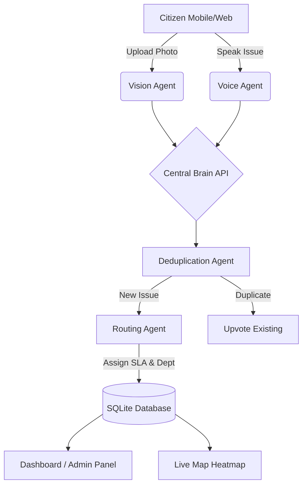

<div align="center">
  
  
  # NagrikAI: AI-Powered Civic Intelligence
  
  **"Every Pothole. Every Voice."**
  
  [](https://reactjs.org/)
  [](https://vitejs.dev/)
  [](https://tailwindcss.com/)
  [](https://fastapi.tiangolo.com/)
  [](https://ai.google.dev/)
</div>

<br/>

> **NagrikAI** is an autonomous civic intelligence platform that transforms citizens into smart sensors. By leveraging Gemini 2.0 Vision and Multilingual Voice Agents, we eliminate reporting friction, automate municipal routing, and provide real-time, geolocated dashboards for urban administrators.

---

## ✨ Key Features

### 🎙️ 1. Zero-Friction Multimodal Reporting
Citizens no longer need to fill out 10-page municipal forms. 
- **Visual Scan:** Snap a photo of a pothole, broken streetlight, or water leak. The Gemini Vision Agent automatically categorizes the anomaly and assesses severity.
- **Multilingual Voice AI:** Speak naturally in Hindi, Gujarati, or English. Our Voice AI transcribes, translates, and extracts structured data (Category, Location, Severity) in milliseconds.

### 🤖 2. Autonomous Multi-Agent Architecture
NagrikAI acts as a municipal force-multiplier through a swarm of AI agents:
* **Deduplication Agent:** Geofences incoming reports against open issues to prevent duplicate spam.
* **Routing Agent:** Calculates Service Level Agreements (SLAs) and assigns the issue to the correct municipal department.
* **Escalation Agent:** Automatically flags SLA breaches.

### 🗺️ 3. Real-Time Civic Command Center
A beautiful, glassmorphic React dashboard featuring a live Leaflet Heatmap, real-time civic health scores, and department performance metrics.

---

## 🏛️ System Architecture



---

## 🚀 Quick Start (Local Development)

### Prerequisites
- Node.js (v18+)
- Python (3.10+)
- Google Gemini API Key

### Installation

**1. Clone the repository**
```bash
git clone https://github.com/RajBarot3826/NagrikAI.git
cd NagrikAI
```

**2. Start the FastAPI Backend**
```bash
cd backend
python -m venv venv
# Windows:
venv\Scripts\activate
# Mac/Linux:
source venv/bin/activate

pip install -r requirements.txt
# Set your Gemini API Key
set GEMINI_API_KEY="your_api_key_here" # Windows
export GEMINI_API_KEY="your_api_key_here" # Mac/Linux

uvicorn main:app --reload
```

**3. Start the Vite Frontend**
Open a new terminal window:
```bash
cd frontend
npm install
npm run dev
```

The application will be running at `http://localhost:5173`.

---

## 🎨 UI Showcase

The platform features a modern, clean, and highly accessible user interface built with TailwindCSS and Framer Motion.

<div align="center">
  <table>
    <tr>
      <td width="50%" align="center"><b>Live Map Heatmap</b></td>
      <td width="50%" align="center"><b>AI Issue Reporter</b></td>
    </tr>
    <tr>
      <td><code>Intelligent clustering and severity mapping of urban anomalies.</code></td>
      <td><code>Multilingual voice and vision processing.</code></td>
    </tr>
  </table>
</div>

---

<div align="center">
  <i>Built with ❤️ for a smarter, safer, and cleaner future.</i>
</div>